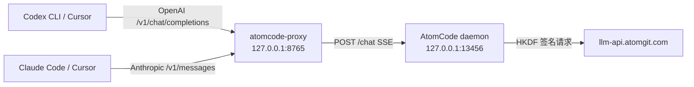

# atomcode-proxy

把 OpenAI / Anthropic 兼容协议翻译为 AtomCode 本地 daemon 协议的适配代理，
使 Codex CLI、Cursor 等工具可以直接使用 AtomCode 的云端模型。

## 架构



数据流：上游客户端 -> 本代理（协议翻译）-> AtomCode 本地 daemon（`/sessions` + `/chat`）-> 云端。

## 前置条件

1. AtomCode daemon 已启动并监听 `127.0.0.1:13456`：

```powershell
Start-Process "C:\Users\Administrator\AppData\Local\AtomCode\atomcode.exe" `
  -ArgumentList "daemon","--port","13456" -WindowStyle Hidden
```

2. Python 3.10+，安装依赖：

```bash
pip install -r requirements.txt
```

## 启动

```bash
python run.py
# 默认监听 127.0.0.1:8765
```

## 配置

优先使用项目根目录的 `.env` 文件（已提供，含注释说明），复制 `.env.example` 可重置。
优先级：**已存在的系统环境变量 > `.env` 文件 > 内置默认值**。

| 变量 | 默认值 | 说明 |
|---|---|---|
| `ATOMCODE_PROXY_HOST` | `127.0.0.1` | 代理监听地址 |
| `ATOMCODE_PROXY_PORT` | `8765` | 代理监听端口 |
| `ATOMCODE_DAEMON_URL` | `http://127.0.0.1:13456` | daemon 地址 |
| `ATOMCODE_DAEMON_TOKEN` | `atomcode_webui` | daemon 认证 token |
| `ATOMCODE_DEFAULT_PROVIDER` | `AtomGit-deepseek-v4-flash` | 默认模型 provider |
| `ATOMCODE_APPROVAL_MODE` | `bypass` | 审批模式：`bypass`/`build`/`plan`/`accept_edits` |
| `ATOMCODE_PROXY_WORKDIR` | 用户主目录 | daemon 工作目录 |
| `ATOMCODE_MODEL_ALIAS` | 空 | 模型别名，逗号分隔 `k=v`，如 `gpt-4o=AtomGit-deepseek-v4-flash` |

`.env` 加载在 `config.py` 模块导入时完成，无需额外依赖（自带轻量解析，仅支持 `KEY=VALUE`、`#` 注释、引号包裹值）。

## 客户端接入

### Codex CLI

```bash
# config.toml
model_provider = "atomcode"
model = "AtomGit-deepseek-v4-flash"

[model_providers.atomcode]
name = "atomcode"
base_url = "http://127.0.0.1:8765/v1"
env_key = "ATOMCODE_API_KEY"   # 任意非空值即可，代理不校验
```

### Cursor（OpenAI 兼容）

Settings -> Models -> 添加 "OpenAI Compatible" provider：
- Base URL: `http://127.0.0.1:8765/v1`
- API Key: 任意值

### Claude Code（Anthropic 兼容）

```bash
export ANTHROPIC_BASE_URL="http://127.0.0.1:8765"
export ANTHROPIC_AUTH_TOKEN="dummy"
```

## 协议映射说明

- OpenAI `messages` 取**最后一条 user 消息**发给 daemon；上下文由 daemon 侧 session 记忆（按 working_dir 复用）。
- `reasoning` 事件映射为 OpenAI 的 `reasoning_content`（DeepSeek 风格）；Anthropic 端忽略 reasoning 只传正文。
- `text` 事件按 8 字符切块模拟流式输出。
- 工具调用：daemon 处于 `bypass` 模式自行执行工具，代理不做透传。

## 端点

| 方法 | 路径 | 说明 |
|---|---|---|
| POST | `/v1/chat/completions` | OpenAI 对话（stream 与非 stream） |
| GET | `/v1/models` | 模型列表（OpenAI 格式） |
| POST | `/v1/messages` | Anthropic 对话（stream 与非 stream） |
| GET | `/health` | 健康检查 |

## 已知限制

- daemon 无 OpenAI/Anthropic 原生端点，必须经本代理转发。
- 云端直连需要 HKDF 请求签名，本代理只走本地 daemon，不直连云端。
- 多客户端共用同一 working_dir 时共享同一 daemon session（上下文会串），可用 `ATOMCODE_PROXY_WORKDIR` 或各自环境变量隔离。