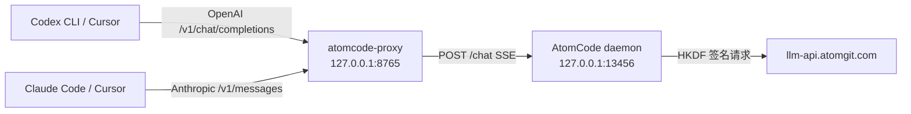

# atomcode-proxy

把 OpenAI / Anthropic 兼容协议翻译为 AtomCode 本地 daemon 协议的适配代理，
使 Codex CLI、Cursor 等工具可以直接使用 AtomCode 的云端模型。

## 架构



数据流：上游客户端 -> 本代理（协议翻译）-> AtomCode 本地 daemon（`/sessions` + `/chat`）-> 云端。

## 便携版下载（Windows）

无需 Python 环境，直接下载单文件 exe 运行。发布页：

👉 <https://github.com/BlackTor-tor/atomcode-proxy/releases>

使用步骤：

1. 从最新 Release 下载 `atomcode-proxy-<版本>-windows-x64.exe` 与 `.env.example`，放到**同一目录**。
2. 将 `.env.example` 复制为 `.env`，按需编辑配置。
3. 双击 exe 即可运行：弹出的**控制台窗口即日志**，关闭窗口即停止服务。默认监听 `127.0.0.1:8765`。

主要配置项（完整列表见 `.env.example`）：

| 变量 | 默认值 | 说明 |
|---|---|---|
| `ATOMCODE_PROXY_HOST` / `ATOMCODE_PROXY_PORT` | `127.0.0.1` / `8765` | 代理监听地址与端口 |
| `ATOMCODE_DAEMON_URL` | `http://127.0.0.1:13456` | AtomCode daemon 地址 |
| `ATOMCODE_DAEMON_TOKEN` | `atomcode_webui` | daemon 认证 token |
| `ATOMCODE_DEFAULT_PROVIDER` | `AtomGit-deepseek-v4-flash` | 默认模型 provider |
| `ATOMCODE_APPROVAL_MODE` | `bypass` | 审批模式 |
| `ATOMCODE_PROXY_WORKDIR` | 用户主目录 | daemon 工作目录 |
| `ATOMCODE_MODEL_ALIAS` | 空 | 模型别名 |

> ⚠️ Windows Defender / 杀毒软件可能对 PyInstaller 打包的单文件程序误报（未经数字签名的可执行文件常见现象）。如遇拦截，请添加信任或允许运行，也可按下文自行从源码构建。

## 前置条件

1. AtomCode daemon 已启动并监听 `127.0.0.1:13456`：

```powershell
Start-Process "C:\Users\Administrator\AppData\Local\AtomCode\atomcode.exe" `
  -ArgumentList "daemon","--port","13456" -WindowStyle Hidden
```

2. Python 3.10+，安装依赖：

```bash
pip install -r requirements.txt
```

## 启动

```bash
python run.py
# 默认监听 127.0.0.1:8765
```

## 从源码构建

开发模式直接运行：

```powershell
python run.py
```

构建便携版单文件 exe（PyInstaller onefile）：

```powershell
.\scripts\build.ps1 -Version 0.1.0
# 产物在 release\ 目录
```

自动发布：推送 `v*` 格式的 tag（如 `git tag v0.1.0; git push origin v0.1.0`）会触发 GitHub Actions（`.github/workflows/release.yml`）在 Windows 上自动构建 exe 并发布 Release，版本号取自 tag 名。

## 配置

优先使用项目根目录的 `.env` 文件（已提供，含注释说明），复制 `.env.example` 可重置。
优先级：**已存在的系统环境变量 > `.env` 文件 > 内置默认值**。

| 变量 | 默认值 | 说明 |
|---|---|---|
| `ATOMCODE_PROXY_HOST` | `127.0.0.1` | 代理监听地址 |
| `ATOMCODE_PROXY_PORT` | `8765` | 代理监听端口 |
| `ATOMCODE_DAEMON_URL` | `http://127.0.0.1:13456` | daemon 地址 |
| `ATOMCODE_DAEMON_TOKEN` | `atomcode_webui` | daemon 认证 token |
| `ATOMCODE_DEFAULT_PROVIDER` | `AtomGit-deepseek-v4-flash` | 默认模型 provider |
| `ATOMCODE_APPROVAL_MODE` | `bypass` | 审批模式：`bypass`/`build`/`plan`/`accept_edits` |
| `ATOMCODE_PROXY_WORKDIR` | 用户主目录 | daemon 工作目录 |
| `ATOMCODE_MODEL_ALIAS` | 空 | 模型别名，逗号分隔 `k=v`，如 `gpt-4o=AtomGit-deepseek-v4-flash` |

`.env` 加载在 `config.py` 模块导入时完成，无需额外依赖（自带轻量解析，仅支持 `KEY=VALUE`、`#` 注释、引号包裹值）。

## 客户端接入

通用要点：

- **Base URL（OpenAI 兼容）**：`http://127.0.0.1:8765/v1`
- **Base URL（Anthropic 兼容）**：`http://127.0.0.1:8765`
- **API Key**：任意非空值即可（代理不校验）
- **可用模型**：`AtomGit-deepseek-v4-flash`（默认）、`AtomGit-Qwen-Qwen3-VL-8B-Instruct`

### Codex CLI（OpenAI 兼容）

```toml
# ~/.codex/config.toml
model_provider = "atomcode"
model = "AtomGit-deepseek-v4-flash"

[model_providers.atomcode]
name = "atomcode"
base_url = "http://127.0.0.1:8765/v1"
env_key = "ATOMCODE_API_KEY"   # 任意非空值即可，代理不校验
```

```powershell
$env:ATOMCODE_API_KEY = "dummy"
codex exec "你好"
```

### Cursor（OpenAI 或 Anthropic 兼容）

Settings -> Models -> 添加 provider：

- **方式一**（OpenAI 兼容）：Type 选 "OpenAI"，Base URL 填 `http://127.0.0.1:8765/v1`，API Key 任意值
- **方式二**（Anthropic 兼容）：Type 选 "Anthropic"，Base URL 填 `http://127.0.0.1:8765`，API Key 任意值

添加模型后勾选 `AtomGit-deepseek-v4-flash` 即可使用。

### Claude Code（Anthropic 兼容）

```powershell
$env:ANTHROPIC_BASE_URL = "http://127.0.0.1:8765"
$env:ANTHROPIC_AUTH_TOKEN = "dummy"
claude
```

### Cline / Roo Code（VS Code 插件，OpenAI 兼容）

API Provider 选 **OpenAI Compatible**：

- Base URL: `http://127.0.0.1:8765/v1`
- API Key: 任意值
- Model ID: `AtomGit-deepseek-v4-flash`

### Cherry Studio / Chatbox（桌面客户端，OpenAI 兼容）

添加自定义 Provider：

- API 地址: `http://127.0.0.1:8765/v1`
- API Key: 任意值
- 模型名: `AtomGit-deepseek-v4-flash`

### OpenAI SDK（编程调用）

```python
from openai import OpenAI

client = OpenAI(
    base_url="http://127.0.0.1:8765/v1",
    api_key="dummy",
)
resp = client.chat.completions.create(
    model="AtomGit-deepseek-v4-flash",
    messages=[{"role": "user", "content": "你好"}],
)
print(resp.choices[0].message.content)
```

### curl 快速验证

```bash
curl http://127.0.0.1:8765/v1/chat/completions \
  -H "Content-Type: application/json" \
  -H "Authorization: Bearer dummy" \
  -d '{"model":"AtomGit-deepseek-v4-flash","messages":[{"role":"user","content":"说你好"}]}'
```

## 协议映射说明

- OpenAI `messages` 取**最后一条 user 消息**发给 daemon；上下文由 daemon 侧 session 记忆（按 working_dir 复用）。
- `reasoning` 事件映射为 OpenAI 的 `reasoning_content`（DeepSeek 风格）；Anthropic 端忽略 reasoning 只传正文。
- `text` 事件按 8 字符切块模拟流式输出。
- 工具调用：daemon 处于 `bypass` 模式自行执行工具，代理不做透传。

## 端点

| 方法 | 路径 | 说明 |
|---|---|---|
| POST | `/v1/chat/completions` | OpenAI 对话（stream 与非 stream） |
| GET | `/v1/models` | 模型列表（OpenAI 格式） |
| POST | `/v1/messages` | Anthropic 对话（stream 与非 stream） |
| GET | `/health` | 健康检查 |

## 已知限制

- daemon 无 OpenAI/Anthropic 原生端点，必须经本代理转发。
- 云端直连需要 HKDF 请求签名，本代理只走本地 daemon，不直连云端。
- 多客户端共用同一 working_dir 时，session 池已按客户端身份（auth + user-agent）隔离，各客户端上下文互不串扰。
- 工具调用由 daemon 在 `bypass` 模式下自行执行（如文件读写、命令执行），**不映射为 OpenAI/Anthropic 的 tool_calls 协议**；因此依赖标准 tool_calls 的客户端（如强制 function calling 的编排框架）可能无法获得工具结果透传，但对话与代码生成不受影响。
- 模型的 `reasoning_content`（思维链）仅在 OpenAI 兼容端点返回；Anthropic 端点忽略 reasoning，只输出正文，避免客户端因缺 signature 报错。