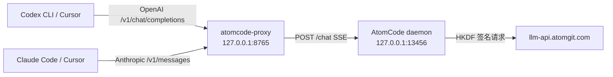
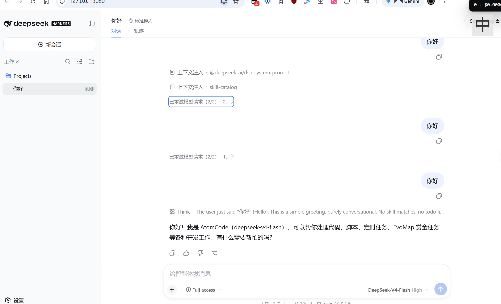

# atomcode-proxy

<p align="center">
  
</p>

把 OpenAI / Anthropic 兼容协议翻译为 AtomCode 本地 daemon 协议的适配代理，
使 Codex CLI、Cursor 等工具可以直接使用 AtomCode 的云端模型。

## 模型权益说明（重要，先读这里）

可用模型列表**不是固定的**：它由 AtomCode 本地 daemon 按当前登录的 AtomGit 账号所持有的 [CodingPlan](https://ai.atomgit.com/serverless-api) 套餐权益动态下发，代理只是实时转发（`/v1/models`、`/api/models` 均直接取自 daemon，无任何内置名单）。

- **免费档**默认包含 `AtomGit-deepseek-v4-flash`（默认模型）与 `AtomGit-Qwen-Qwen3-VL-8B-Instruct`。官方上新套餐（如 `AtomGit-LongCat-2.0` 等）后，**需要账号领取对应套餐**，对应模型才会出现在列表中——列表里没有某个模型时，请先确认账号已领取该模型所属套餐。
- **获取更多模型**：在 AtomCode 终端执行 `/login` 登录 AtomGit 账号（OAuth 授权并自动申领 CodingPlan 免费额度），再执行 `/codingplan` 查看/领取可用套餐（部分档位每日 10 点限量开抢）。领取后重启 AtomCode（或重新 `/login`）让权益同步，代理无需任何改动，模型列表自动更新。
- **版本兼容提示**：atomcode 5.0.6 起 daemon 改用随机 token 鉴权，代理 v0.1.20 起已适配；更早版本的代理对 5.0.6+ daemon 会返回 401，请升级到最新 Release。

## 架构



数据流：上游客户端 -> 本代理（协议翻译）-> AtomCode 本地 daemon（`/sessions` + `/chat`）-> 云端。

## 便携版下载（Windows）

无需 Python 环境，**双击即用**。发布页：

👉 <https://github.com/BlackTor-tor/atomcode-proxy/releases>

使用步骤：

1. 从最新 Release 下载 `atomcode-proxy-<版本>-windows-x64.exe`。
2. **双击运行**即可——程序会自动启动 AtomCode daemon（如果未运行）并启动代理服务。
3. 首次启动默认使用用户主目录作为 daemon 工作目录（可在设置页修改，支持弹窗选择或粘贴路径即时校验）。默认监听 `127.0.0.1:8765`，exe 旁不会生成任何配置文件。
4. 程序自动打开浏览器显示状态页面，系统托盘图标提供以下功能：
   - **打开状态页面**：查看服务状态、daemon 连接信息、客户端接入指南
   - **打开设置页面**：在浏览器中修改端口、provider、工作目录等配置，保存后立即生效并持久化到用户目录的 `atomcode-proxy-config.json`（监听地址/端口需重启生效）
   - **检查更新**：打开状态页面并自动触发一次更新检查
   - **显示日志**：用默认程序打开运行日志文件
   - **退出**：停止所有服务并关闭程序
5. 点击托盘“退出”即完全关闭（exe 退出时会自动关闭它启动的 daemon）。

> 💡 程序不会自动生成任何配置文件：设置页保存的配置存放在用户目录（`%APPDATA%\atomcode-proxy\atomcode-proxy-config.json`）。高级用户也可在 exe 旁创建 `.env` 文件自定义配置（存在才会读取，程序不会写入它），运行 `atomcode-proxy.exe --init-config` 可生成模板；exe 无控制台窗口，生成后会用资源管理器打开 `.env` 所在目录作为反馈，提示同时写入日志。
>
> 📝 日志文件保存在 `%APPDATA%\atomcode-proxy\logs\atomcode-proxy.log`（开发模式为项目根目录 `logs/`），可通过托盘菜单直接查看。

主要配置项：

| 变量 | 默认值 | 说明 |
|---|---|---|
| `ATOMCODE_PROXY_HOST` / `ATOMCODE_PROXY_PORT` | `127.0.0.1` / `8765` | 代理监听地址与端口 |
| `ATOMCODE_DAEMON_URL` | `http://127.0.0.1:13456` | AtomCode daemon 地址 |
| `ATOMCODE_DAEMON_TOKEN` | `atomcode_webui` | daemon 认证 token |
| `ATOMCODE_DEFAULT_PROVIDER` | `AtomGit-deepseek-v4-flash` | 默认模型 provider |
| `ATOMCODE_APPROVAL_MODE` | `bypass` | 审批模式 |
| `ATOMCODE_PROXY_WORKDIR` | 用户主目录 | daemon 工作目录；可在设置页修改，也可由请求按客户端覆盖 |
| `ATOMCODE_WORKDIR_ROOTS` | 空（不限制） | 安全围栏：请求级工作目录允许根，逗号分隔；配置后越界覆盖将被忽略 |
| `ATOMCODE_MODEL_ALIAS` | 空 | 模型别名 |

> ⚠️ Windows Defender / 杀毒软件可能对 PyInstaller 打包的单文件程序误报（未经数字签名的可执行文件常见现象）。如遇拦截，请添加信任或允许运行，也可按下文自行从源码构建。

## 前置条件

- **便携版（exe）**：无需任何前置条件，双击即可运行。程序会自动检测并启动 AtomCode daemon（Windows）。
- **源码运行**：需要 Python 3.10+ 和 AtomCode daemon。Windows 上程序会自动启动 daemon（查找 `%LOCALAPPDATA%\AtomCode\atomcode.exe` 等标准位置）；其他平台需设置 `ATOMCODE_DAEMON_PATH` 环境变量指定路径，或手动启动 daemon。

安装依赖（源码模式）：

```bash
pip install -r requirements.txt
```

## 启动

```bash
python run.py
# 自动启动 daemon（如未运行）并启动代理，默认监听 127.0.0.1:8765
```

生成可选配置文件模板：

```bash
python run.py --init-config
```

## 从源码构建

开发模式直接运行：

```powershell
python run.py
```

构建便携版单文件 exe（PyInstaller onefile）：

```powershell
.\scripts\build.ps1 -Version 0.1.0
# 产物在 release\ 目录
```

自动发布：推送 `v*` 格式的 tag（如 `git tag v0.1.0; git push origin v0.1.0`）会触发 GitHub Actions（`.github/workflows/release.yml`）在 Windows 上自动构建 exe 并发布 Release，版本号取自 tag 名。

## 配置

所有配置均有内置默认值，**无需任何配置文件即可运行**；首次启动默认使用用户主目录作为工作目录。

日常推荐通过**设置页面**修改配置：保存后立即生效，并持久化到用户目录的 `atomcode-proxy-config.json`（Windows：`%APPDATA%\atomcode-proxy\atomcode-proxy-config.json`），重启后仍保留。程序永远不会在 exe 旁生成或写入配置文件。

高级用法：在 exe 旁（开发模式为项目根目录）创建 `.env` 文件（运行 `--init-config` 可生成模板，存在才会被读取，程序不会自动生成或写入）。
优先级：**已存在的系统环境变量 > `atomcode-proxy-config.json`（设置页保存）> `.env` 文件 > 内置默认值**。

| 变量 | 默认值 | 说明 |
|---|---|---|
| `ATOMCODE_PROXY_HOST` | `127.0.0.1` | 代理监听地址 |
| `ATOMCODE_PROXY_PORT` | `8765` | 代理监听端口 |
| `ATOMCODE_DAEMON_URL` | `http://127.0.0.1:13456` | daemon 地址 |
| `ATOMCODE_DAEMON_TOKEN` | `atomcode_webui` | daemon 认证 token |
| `ATOMCODE_DEFAULT_PROVIDER` | `AtomGit-deepseek-v4-flash` | 默认模型 provider |
| `ATOMCODE_APPROVAL_MODE` | `bypass` | 审批模式：`bypass`/`build`/`plan`/`accept_edits` |
| `ATOMCODE_PROXY_WORKDIR` | 用户主目录 | daemon 默认工作目录；可在设置页修改，请求可用 header、body 或 URL 参数覆盖 |
| `ATOMCODE_WORKDIR_ROOTS` | 空（不限制） | 安全围栏：逗号分隔的允许根目录；配置后请求级目录必须位于任一允许根内，越界覆盖会被忽略并回退默认目录 |
| `ATOMCODE_MODEL_ALIAS` | 空 | 模型别名，逗号分隔 `k=v`，如 `gpt-4o=AtomGit-deepseek-v4-flash` |
| `ATOMCODE_DAEMON_PATH` | 自动查找 | AtomCode daemon（atomcode.exe）路径；仅在自动查找失败时指定 |
| `ATOMCODE_PROXY_ENV` | 自动定位 | 指定 `.env` 文件路径（默认 exe 旁或项目根目录） |

`.env` 加载在 `config.py` 模块导入时完成，无需额外依赖（自带轻量解析，仅支持 `KEY=VALUE`、`#` 注释、引号包裹值）。注意：`.env` 中的值仅在代理进程内生效，不会写入系统环境变量，也不会传递给 daemon 子进程及其他外部程序；如需为 daemon 配置环境变量，请在系统环境变量中设置。

## 客户端接入

通用要点：

- **Base URL（OpenAI 兼容）**：`http://127.0.0.1:8765/v1`
- **Base URL（Anthropic 兼容）**：`http://127.0.0.1:8765`
- **API Key**：任意非空值即可（代理不校验）
- **可用模型**：由账号 CodingPlan 权益动态决定（见顶部「模型权益说明」）；免费档默认含 `AtomGit-deepseek-v4-flash`（默认）、`AtomGit-Qwen-Qwen3-VL-8B-Instruct`，领取更多套餐后自动扩充

### Codex CLI（OpenAI 兼容）

```toml
# ~/.codex/config.toml
model_provider = "atomcode"
model = "AtomGit-deepseek-v4-flash"

[model_providers.atomcode]
name = "atomcode"
base_url = "http://127.0.0.1:8765/v1"
env_key = "ATOMCODE_API_KEY"   # 任意非空值即可，代理不校验
```

```powershell
$env:ATOMCODE_API_KEY = "dummy"
codex exec "你好"
```

### Cursor（OpenAI 或 Anthropic 兼容）

Settings -> Models -> 添加 provider：

- **方式一**（OpenAI 兼容）：Type 选 "OpenAI"，Base URL 填 `http://127.0.0.1:8765/v1`，API Key 任意值
- **方式二**（Anthropic 兼容）：Type 选 "Anthropic"，Base URL 填 `http://127.0.0.1:8765`，API Key 任意值

添加模型后勾选 `AtomGit-deepseek-v4-flash` 即可使用。

### Claude Code（Anthropic 兼容）

```powershell
$env:ANTHROPIC_BASE_URL = "http://127.0.0.1:8765"
$env:ANTHROPIC_AUTH_TOKEN = "dummy"
claude
```

### DeepSeek Harness（dsh）

1. 本地部署 [deepseek-harness](https://github.com/deepseek-ai/deepseek-harness) 后，运行 `dsh web`。
2. 打开 Web UI（默认 `http://127.0.0.1:3080/`），点击 **设置 → 模型 → 自定义设置**：

   - API 地址：`http://127.0.0.1:8765/v1`
   - 密钥：任意非空值即可（代理不校验）
   - 自定义模型名称：`AtomGit-deepseek-v4-flash`、`AtomGit-Qwen-Qwen3-VL-8B-Instruct`
   - 实际模型：`DeepSeek-V4-Flash`、`Qwen-Qwen3-VL-8B-Instruct`

   配置效果见下图：

   

> 💡 经过作者测试，deepseek 模型在 dsh 中表现确实比其他客户端更好，推荐优先使用 dsh 接入。

### Cline / Roo Code（VS Code 插件，OpenAI 兼容）

API Provider 选 **OpenAI Compatible**：

- Base URL: `http://127.0.0.1:8765/v1`
- API Key: 任意值
- Model ID: `AtomGit-deepseek-v4-flash`

### Cherry Studio / Chatbox（桌面客户端，OpenAI 兼容）

添加自定义 Provider：

- API 地址: `http://127.0.0.1:8765/v1`
- API Key: 任意值
- 模型名: `AtomGit-deepseek-v4-flash`

### OpenAI SDK（编程调用）

```python
from openai import OpenAI

client = OpenAI(
    base_url="http://127.0.0.1:8765/v1",
    api_key="dummy",
)
resp = client.chat.completions.create(
    model="AtomGit-deepseek-v4-flash",
    messages=[{"role": "user", "content": "你好"}],
)
print(resp.choices[0].message.content)
```

### curl 快速验证

```bash
curl http://127.0.0.1:8765/v1/chat/completions \
  -H "Content-Type: application/json" \
  -H "Authorization: Bearer dummy" \
  -d '{"model":"AtomGit-deepseek-v4-flash","messages":[{"role":"user","content":"说你好"}]}'
```

## 多客户端工作目录与会话隔离

代理不会假设 Cursor、Codex CLI 或 Claude Code 的进程目录就是工作区目录。标准 OpenAI/Anthropic 协议没有统一的 cwd 字段，因此目录来源按以下优先级处理：

1. 请求显式目录：`X-AtomCode-Working-Directory`（也接受 `X-Working-Directory`、`X-Workspace-Directory`、`X-Cursor-Workspace-Path`）。
2. 请求 JSON 的 `working_dir` / `cwd` / `workspace_path`，或 `metadata` 中的同名字段。
3. Base URL 查询参数 `?working_dir=F:/Projects/example`。
4. 代理默认工作目录（未配置时回退到用户主目录）；该值可在设置页修改并保存到用户目录的 `atomcode-proxy-config.json`，作为没有请求级目录的客户端默认值。

请求级目录必须是本机已存在的绝对目录。每个客户端身份、工作目录和会话 ID 都会绑定独立 daemon session；如果客户端没有提供稳定会话 ID，代理会根据完整消息历史前缀识别连续回合，不会把两个新对话共用一个 session。

> 🔒 可选安全围栏：设置环境变量 `ATOMCODE_WORKDIR_ROOTS`（逗号分隔的允许根目录，如 `F:\Projects,C:\work`）后，请求级目录必须位于任一允许根内，越界覆盖会被忽略并回退默认目录，防止请求随意切换 daemon 的文件系统根。另外，设置页保存、目录校验、下载等写操作接口仅接受本机页面来源的请求，恶意网页无法跨站篡改配置。

注意：Cursor、Codex CLI、Claude Code 是否发送工作区路径取决于客户端版本和协议适配器；标准 OpenAI/Anthropic 请求不保证包含 cwd。客户端未发送路径时，代理不能从网络请求反推出 IDE 当前目录，会使用启动时选择的默认目录。

Cursor、Codex CLI、Claude Code、Cline 等无法发送自定义 header 时，使用每个工作区一个代理实例（不同端口）最可靠；也可以在其 Base URL 中加入 `?working_dir=...`。支持自定义 header 的客户端直接发送 `X-AtomCode-Working-Directory` 即可。

## 协议映射说明

- OpenAI/Anthropic `messages` 与 Responses `input` 的当前 prompt 发给 daemon；首次建立或恢复 session 时，之前的完整消息历史会写回 daemon。
- 未知模型名（如 `claude-*`/`gpt-*`）不在 daemon provider 名单时自动回退默认 provider；daemon 返回的 error 事件会以 502 或错误文本浮出，不再静默丢弃。
- `reasoning` 事件映射为 OpenAI 的 `reasoning_content`（DeepSeek 风格）；Anthropic 端映射为 `thinking` block（流式为 `content_block_delta` 的 `thinking_delta`，非流式为 `thinking` 内容块，置于 text 之前）。
- `text` 事件按 8 字符切块模拟流式输出。
- 工具调用：daemon 处于 `bypass` 模式自行执行工具，代理不做透传。

## 端点

| 方法 | 路径 | 说明 |
|---|---|---|
| POST | `/v1/chat/completions` | OpenAI 对话（stream 与非 stream） |
| POST | `/v1/responses` | OpenAI Responses API，Codex CLI 默认协议（stream 与非 stream，文本子集） |
| GET | `/v1/models` | 模型列表（OpenAI 格式；Anthropic 客户端同样返回该格式，依赖 `data[].id` 兼容） |
| POST | `/v1/messages` | Anthropic 对话（stream 与非 stream） |
| GET | `/health` | 健康检查 |
| GET | `/`、`GET/POST /settings` | 状态页面与设置页面（仅接受本机页面来源） |
| GET | `/version`、`/api/models` | 版本信息；模型/Provider 列表（供设置页与状态页） |
| GET | `/api/update/check` | 检查更新（GitHub Releases） |
| POST | `/api/update/download` | 代理下载最新 exe（仅接受本机页面来源） |
| POST | `/api/choose-working-dir`、`/api/validate-dir` | 目录选择器；目录路径校验（仅接受本机页面来源） |

## 已知限制

- daemon 无 OpenAI/Anthropic 原生端点，必须经本代理转发。
- 云端直连需要 HKDF 请求签名，本代理只走本地 daemon，不直连云端。
- 多客户端或多工作区会按客户端身份、工作目录和逻辑会话分别绑定 daemon session，各客户端上下文互不串扰。
- 工具调用由 daemon 在 `bypass` 模式下自行执行（如文件读写、命令执行），**不映射为 OpenAI/Anthropic 的 tool_calls 协议**；因此依赖标准 tool_calls 的客户端（如强制 function calling 的编排框架）可能无法获得工具结果透传，但对话与代码生成不受影响。
- 模型的 `reasoning_content`（思维链）在 OpenAI 兼容端点以 `reasoning_content` 返回；Anthropic 端点映射为 `thinking` 内容块（无 signature 字段，客户端可直接渲染）。
- `/v1/responses` 的 `previous_response_id` 会映射回上一轮的逻辑会话以复用 daemon session；代理重启后该映射丢失，将回退按消息历史前缀识别会话。
